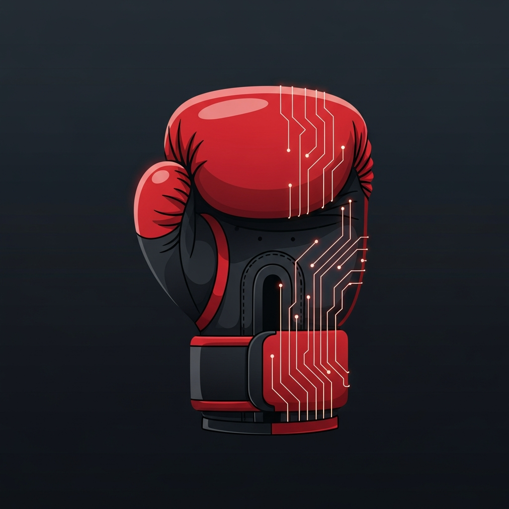

# Boxer AI

AI-powered boxing coaching app for performance analysis, drill recommendations, gym discovery, fighter rankings, and tournament tracking.

<p align="center">
  
</p>

## Features

- **Analyze** — Upload photos or write a match summary and get GPT-4o scores across stance, offense, defense, footwork, and combos
- **Drills** — Personalized drill plans generated from your last analysis
- **Community** — Local gym directory, fighter rankings by weight class, upcoming tournaments, and opponent matching by win rate
- **Dashboard** — Session history, performance trends, and streaks over time
- **Profile** — Set your stance, experience level, and weight class

## Stack

| Layer | Technology |
|---|---|
| Mobile | Expo SDK 54, expo-router, React Native |
| Animations | React Native Reanimated v4 |
| API | Express 5, TypeScript, esbuild |
| Database | PostgreSQL, Drizzle ORM |
| AI | OpenAI GPT-4o |
| Monorepo | pnpm workspaces |

## Project Structure

```
artifacts/
  mobile/          # Expo React Native app
  api-server/      # Express API server
lib/
  db/              # Drizzle schema + migrations
  api-spec/        # OpenAPI spec + codegen
scripts/           # Seed scripts and utilities
```

## Getting Started

### Prerequisites

- Node.js 24+
- pnpm 9+
- PostgreSQL database

### Environment Variables

| Variable | Description |
|---|---|
| `DATABASE_URL` | PostgreSQL connection string |
| `EXPO_PUBLIC_DOMAIN` | Your deployment domain |
| `EXPO_PUBLIC_REPL_ID` | Replit project ID |

### Run Locally

```bash
# Install dependencies
pnpm install

# Push database schema
pnpm --filter @workspace/db run push

# Seed community data (gyms, fighters, tournaments)
pnpm --filter @workspace/scripts run seed-community

# Start API server
pnpm --filter @workspace/api-server run dev

# Start Expo app
pnpm --filter @workspace/mobile run dev
```

### Regenerate API client

```bash
pnpm --filter @workspace/api-spec run codegen
```

### Typecheck

```bash
pnpm run typecheck
```

## Android Build (Google Play)

This project uses [EAS Build](https://docs.expo.dev/build/introduction/) for cloud Android builds.

```bash
cd artifacts/mobile

# Log in to your Expo account
npx eas-cli login

# Build production AAB for Google Play
npx eas-cli build -p android --profile production
```

See `artifacts/mobile/eas.json` for build profiles (development, preview, production).

## Architecture Notes

- **AI analysis** — accepts images, text description, or both; all fields optional
- **Offline sessions** — stored on-device via AsyncStorage; no account required
- **Web preview** — served via Expo web with dark background to match native styling
- **Tab persistence** — all tab screens stay mounted (`enableScreens(false)`) to prevent re-animation on switch
- **Android package** — `com.boxerai.app`

## License

MIT
